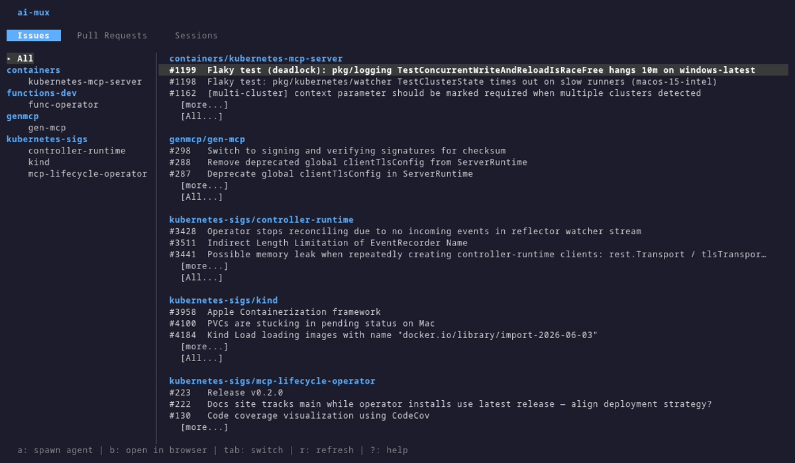

# ai-mux

A terminal-based tool for monitoring multiple GitHub repositories and Jira boards. Watches for new issues, PRs, and Jira items with actionable integrations - spawn AI agent sessions to fix issues or review PRs directly from the dashboard.



## Requirements

- [Go](https://go.dev/) 1.26+
- [`gh`](https://cli.github.com/) CLI — GitHub authentication
- [`tmux`](https://github.com/tmux/tmux) — agent sessions
- `git` — worktree isolation
- Optional: [`acli`](https://bobswift.atlassian.net/wiki/spaces/ACLI/) — Atlassian CLI for Jira integration
- Optional: `notify-send` (Linux) or `osascript` (macOS) for desktop notifications

## Installation

```sh
go install github.com/creydr/ai-mux/cmd/ai-mux@latest
```

## Quick Start

1. Create a config file at `~/.config/ai-mux/config.yaml`:

```yaml
repos:
  - name: owner/repo-a
    path: ~/development/repo-a
  - name: owner/repo-b
    path: ~/development/repo-b

pollInterval: 30s

github:
  tokenFrom: gh

agents:
  - name: claude
    command: claude
  - name: claude YOLO
    command: claude
    args:
      - "--dangerously-skip-permissions"
  - name: gemini
    command: gemini

# Optional: Jira integration
jira:
  jql: "assignee = currentUser() AND resolution = Unresolved"
  orderBy: "priority DESC, updated DESC"
  maxResults: 50
```

2. Start the daemon:

```sh
ai-mux daemon start
```

3. Open the dashboard:

```sh
ai-mux dashboard
```

## Usage

### Daemon

```sh
# Start the daemon
ai-mux daemon start

# Start the daemon in the background
ai-mux daemon start --background

# Check daemon status
ai-mux daemon status

# Stop the daemon
ai-mux daemon stop

# Install as a system service (systemd on Linux, launchd on macOS)
ai-mux daemon install

# Remove the system service
ai-mux daemon uninstall
```

Sessions are persisted to `~/.ai-mux/sessions.json` and survive daemon restarts. On startup, the daemon reconciles persisted sessions with live tmux state.

### Dashboard

```sh
ai-mux dashboard
```

Keyboard shortcuts:

**Item list (Issues/PRs/Jira tabs):**
- `Tab` — switch between tabs (Jira tab appears when configured)
- Arrow keys — navigate items
- `Enter` — open item detail view
- `a` — spawn agent session for selected item
- `t` — attach to an existing session for this item
- `b` / `o` — open item in browser
- `r` — refresh
- `?` — show keyboard shortcut help
- `Ctrl-c` — quit

**Item detail view:**
- Arrow keys — scroll content
- `a` — spawn agent session for this item
- `t` — attach to an existing session for this item
- `o` — open in browser
- `r` — refresh
- `Esc` — back to list

**Sessions tab:**
- Arrow keys — navigate sessions
- `Enter` — attach to session (opens tmux)
- `n` — rename selected session
- `s` — stop selected session
- `Ctrl-c` — quit

**Attached session view:**
- `p` — paste context prompt into the agent (types without submitting, so you can edit first)
- `n` — rename session (pre-filled with current name)
- `PgUp` / `PgDn` — scroll output
- `Esc` — back

**tmux session:**
- `ctrl-b d` — detach
- `ctrl-b n` — rename session

### Session

```sh
# List all sessions
ai-mux session list

# Attach to a running session (opens tmux)
ai-mux session attach <session-id>

# View output of a completed session
ai-mux session attach <session-id>

# Rename a session
ai-mux session rename <session-id> "descriptive name"
```

For running/pending sessions, `attach` opens the tmux session directly. For completed/failed/stopped sessions, it streams the captured output to stdout.

## Configuration Reference

| Field | Type | Default | Description |
|-------|------|---------|-------------|
| `repos` | list | required | Repositories to watch |
| `repos[].name` | string | required | Repository in `owner/repo` format |
| `repos[].path` | string | required | Local clone path (supports `~`) |
| `pollInterval` | duration | `30s` | How often to poll GitHub |
| `github.tokenFrom` | string | `gh` | Token source: `gh` (GitHub CLI) |
| `github.token` | string | — | Direct token (not recommended) |
| `github.tokenEnv` | string | — | Environment variable with token |
| `agents` | list | — | AI agent configurations |
| `agents[].name` | string | required | Agent identifier |
| `agents[].command` | string | required | Command to run the agent |
| `agents[].args` | list | — | Extra arguments passed to the command |
| `notifications.desktop.enabled` | bool | `false` | Enable desktop notifications |
| `notifications.desktop.events` | list | all | Event types to notify on |
| `jira.jql` | string | — | JQL filter for Jira items (required when `jira` block present) |
| `jira.orderBy` | string | — | JQL ORDER BY clause |
| `jira.maxResults` | int | `50` | Max items to fetch per poll |
| `dashboard.itemsPerRepo` | int | `3` | Items shown per repo before expanding |
| `daemon.socket` | string | `/tmp/ai-mux.sock` | Unix socket path |

### Jira Integration

When the `jira` block is present in the config, a Jira tab appears in the dashboard between PRs and Sessions. Items are fetched via the `acli` CLI tool using the configured JQL query. Pressing `a` on a Jira item opens a repo picker (or skips it if only one repo is configured), then follows the same agent/worktree flow as Issues and PRs.

### Worktree Isolation

Every agent session runs in an isolated git worktree at `<repo-path>/.worktrees/<action>-<number>`. For Jira items, the pattern is `jira-<agent>-<KEY>`. This allows multiple agent sessions to run in parallel without interfering with each other or the current checkout. When multiple sessions target the same item, each gets its own worktree with a unique branch (`ai-mux/<name>`) so they don't conflict. Worktrees with no changes are cleaned up automatically.

## Development

See [DEVELOPMENT.md](DEVELOPMENT.md) for build instructions, architecture, and project structure.
